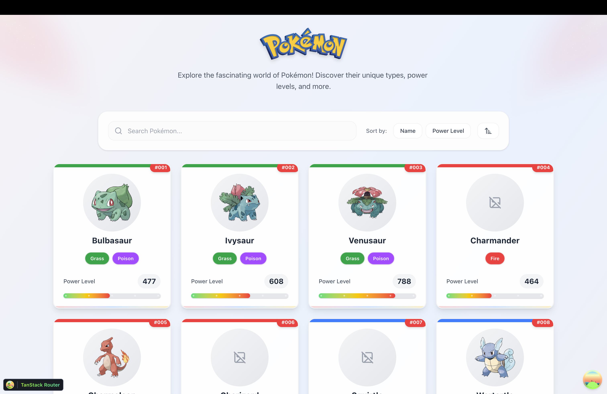

# 🎮 Pokédx Challenge

## 📱 Overview

Interactive Pokédx app with modern design, smooth animations, and responsive interface. Browse, search, and discover Pokémon with their types and power levels.

**Key Features:**
- 🔍 Smart search and filtering
- 📱 Mobile-first responsive design
- ⚡ Fast loading with image fallbacks
- 🎨 Smooth animations (Framer Motion)
- 📲 PWA ready

---

## 🖼️ Preview

<p align="center">
  
</p>



---

## 🛠️ Tech Stack

- **React** + TypeScript + Vite
- **TailwindCSS** + Framer Motion
- **TanStack Router** + TanStack Query
- **PokéAPI** integration

---

## 🚀 Quick Start

```bash
# Clone and install
git clone https://github.com/your-username/pokedex-challenge.git
cd pokedex-challenge
npm install

# Start development
npm run dev
```

Open [http://localhost:5173](http://localhost:5173)

### Available Scripts
- `npm run dev` – Development server
- `npm run build` – Production build
- `npm run preview` – Preview build

---

## 📁 Structure

```
src/
├── components/          # React components
├── hooks/              # Custom hooks
├── services/           # API integration
├── types/             # TypeScript types
├── utils/             # Utilities & animations
└── routes/            # App routes
```

---

<p align="center">
  Made with ❤️ by <strong>Josmar Junior</strong> | <em>Gotta catch 'em all!</em> 🎮
</p>
